# Friend Finder
Finding friends who are like-minded and have the same interests as you can be difficult. This website tries to change that by letting people find individuals based on a set of criteria. They can do this through a filtering system that lists traits that could make a good friend (like interests, religion, lifestyle choices, etc.)

The goal of this project is to create a proof of concept for a potential dating website. It currently is only scoped to finding friends since that is the most family-friendly topic I could think of for a school project. I can use the finished website to validate my ideas and see what does and doesn't work.

## Table of Contents

<!-- TOC -->

- [Friend Finder](#friend-finder)
    - [Table of Contents](#table-of-contents)
    - [Project structure](#project-structure)
        - [Project architecture](#project-architecture)
    - [Docker setup](#docker-setup)
        - [Running the entire platform](#running-the-entire-platform)

<!-- /TOC -->

## Project structure
This project is structured as a mono repo. All services, front-end applications, etc. are located within this repository. Frontend applications are prefixed by `frontend-`, backend applications are prefixed by `service-`. Applications that sit between the frontend and backend (a gateway for example) will not be prefixed. Backend application libraries (common/architecture code that is re-used by several micro-services) are prefixed by `lib-`.

Most services will use `.env` and `env.php` files to keep track of all environment files and secrets. A `.gitlab` variation of these files (e.g. `.env.gitlab` and `env.gitlab.php`) exists for when a docker hub deployment is started. Each variable prefixed with `GLCI_` will be replaced by a CI/CD variable.

### Project architecture
At the highest level, there are two components:

- Friend finder application
- KeyCloak

The Friend finder application houses all the software components that, when combined, allow a user to find friends. This application will communicate with KeyCloak to provide user authentication.

<br/>
*C4, level 1 - Overview of how a user interacts with the software system.*

<br/>
*C4, level 2 - Overview of how all software systems interact with each other.*

As is being illustrated, the front end will forward all the requests it needs to make to an API gateway. This gateway acts as the access point to the back end. Its main purpose is to route all requests to the appropriate services and to authenticate those requests. The authentication is done through an external identity provider. [KeyCloak](https://www.keycloak.org/) is being used for this. The gateway will route all requests through KeyCloak first to make sure that they are being made by an authenticated user. The way it will check this is through JWT's. Once a request arrives to a service, the first thing that is going to be checked is that the JWT contains a valid user UUID. It will use this UUID to query and store all information that belongs to the user that makes the request.

All services will use [RoadRunner](https://roadrunner.dev/) as their web server and are able to communicate with each other through RabbitMQ. Almost all services will use a relational database to store their data. The search service will use an [Elasticsearch](https://www.elastic.co/guide/en/elasticsearch/reference/current/elasticsearch-intro.html) database to provide near real-time searches.

## Docker setup
Make sure that you have docker with `docker compose` installed and that all env files (`.env` and `env.php`) exist and are filled in with the correct information.

### Running the entire platform
You can start the platform by running the following command:

```bash
$ docker compose up -d
```

This will start the initial application on [http://127.0.0.1:9100](http://127.0.0.1:9100).

Stopping the platform can be done with the following commands:
```bash
$ docker compose stop
$ docker compose down
```
